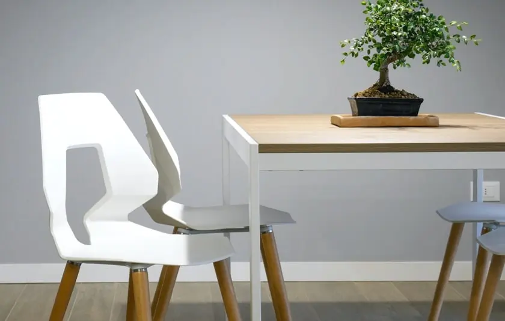

# Frontend Mentor - Room homepage solution

This is a solution to the [Room homepage challenge on Frontend Mentor](https://www.frontendmentor.io/challenges/room-homepage-BtdBY_ENq). Frontend Mentor challenges help you improve your coding skills by building realistic projects.

## Table of contents

- [Overview](#overview)
  - [The challenge](#the-challenge)
  - [Screenshot](#screenshot)
  - [Links](#links)
- [My process](#my-process)
  - [Built with](#built-with)
  - [What I learned](#what-i-learned)
  - [Continued development](#continued-development)
  - [Useful resources](#useful-resources)
- [Author](#author)
- [Acknowledgments](#acknowledgments)

## Overview

### The challenge

Users should be able to:

- View the optimal layout for the site depending on their device's screen size
- See hover states for all interactive elements on the page
- Navigate the slider using either their mouse/trackpad or keyboard

### Screenshot

### Links

- Solution URL: [Code](https://github.com/robcrock/room-homepage)
- Live Site URL: [Site](https://room-homepage-rust-mu.vercel.app/)

## My process

### Built with

- [Tailwind](https://tailwindcss.com/)
- [React](https://reactjs.org/)
- [Next.js](https://nextjs.org/)

### What I learned

I continue to learn how helpful Curso can be. I'm also continuing to expand my repetoire of CSS and Tailwind tricks I'm able to bring to projects. This was the first one where I used Framer Motion and I think there's huge ROI there!

## Author

- Website - [Robert Crocker](https://www.robcrock.com)
- Frontend Mentor - [@robcrock](https://www.frontendmentor.io/profile/robcrock)
- Twitter - [@robcrock](https://twitter.com/robcrock)
- LinkedIn - [@robercrocker](https://www.linkedin.com/in/robertcrocker/)
